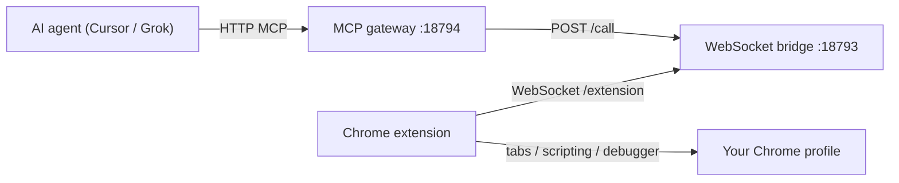

# Browser Bridge — Chrome extension and MCP server

AWFixer Browser Bridge gives AI agents full control over your **local Chrome profile** through a Chrome extension and a local MCP server. Unlike chrome-devtools-mcp, it does not require a remote debugging port or a separate browser profile.

Source lives in [`browser-bridge/`](../browser-bridge/).

## What it does

| Component            | Role                                                                                                                         |
| -------------------- | ---------------------------------------------------------------------------------------------------------------------------- |
| **Chrome extension** | Runs in your normal Chrome. Uses `chrome.tabs`, `chrome.scripting`, `chrome.cookies`, and `chrome.debugger` to control tabs. |
| **WebSocket bridge** | Always-on local server (`127.0.0.1:18793`) that routes commands between the MCP server and the extension.                    |
| **MCP gateway**      | HTTP MCP endpoint (`127.0.0.1:18794/mcp`) that exposes browser tools to Cursor, Grok, or any MCP client.                     |

The agent talks to the MCP gateway → bridge forwards requests over WebSocket → extension executes them in Chrome → results flow back.

## Architecture



### Why use this instead of DevTools MCP?

| DevTools MCP                                    | Browser Bridge                                        |
| ----------------------------------------------- | ----------------------------------------------------- |
| Needs `--remote-debugging-port` or CDP attach   | Works in your everyday Chrome profile                 |
| Often launches an isolated profile              | Uses your real tabs, cookies, logins, and extensions  |
| Limited on some `chrome://` and extension pages | `chrome.debugger` provides raw CDP on attachable tabs |
| No direct access to extension APIs              | Full `chrome.*` extension surface                     |

For Helium-specific CDP attach, see [`.grok/plugins/helium-browser/`](../.grok/plugins/helium-browser/). Browser Bridge is the stock-Chrome / extension-first alternative.

## Prerequisites

- **Bun** 1.3.14 (matches the monorepo `packageManager`)
- **Chrome** or Chromium with extension sideloading enabled
- **Network**: localhost only; no inbound ports exposed beyond your machine

## Quick start

### 1. Generate an auth token

```bash
bash browser-bridge/scripts/setup-token.sh
```

This creates `browser-bridge/.bridge-token` (gitignored, mode `600`) and prints the token. It is copied to your clipboard when `wl-copy`, `xclip`, or `xsel` is available.

Paste the token into the extension popup after installation (step 3).

To view the token again:

```bash
bash browser-bridge/scripts/show-token.sh
```

To rotate the token:

```bash
bash browser-bridge/scripts/setup-token.sh --regenerate
bash browser-bridge/scripts/stop-gateway.sh
bash browser-bridge/scripts/start-gateway.sh
```

Then update the token in the extension popup.

### 2. Start the gateway

```bash
bash browser-bridge/scripts/start-gateway.sh
```

This script:

1. Builds the extension into `browser-bridge/extension/dist`
2. Starts the WebSocket bridge on port **18793**
3. Starts the MCP HTTP gateway on port **18794**
4. Auto-generates a token on first run if `.bridge-token` does not exist

Check status:

```bash
bash browser-bridge/scripts/status.sh
curl http://127.0.0.1:18793/healthz   # extension bridge
curl http://127.0.0.1:18794/healthz   # MCP gateway
```

Stop everything:

```bash
bash browser-bridge/scripts/stop-gateway.sh
```

### 3. Install the Chrome extension

1. Open `chrome://extensions`
2. Enable **Developer mode**
3. Click **Load unpacked**
4. Select `browser-bridge/extension/dist`
5. Open the extension popup (toolbar icon)
6. Paste the auth token from step 1
7. Click **Save & reconnect**

The popup should show **Connected to MCP bridge**. If it stays disconnected, confirm the gateway is running and the token matches.

After code changes, click **Reload** on the extension card in `chrome://extensions`, or re-run `start-gateway.sh` (which rebuilds `extension/dist`).

### 4. Configure your MCP client

Merge into your MCP config (see also [`browser-bridge/.mcp.json`](../browser-bridge/.mcp.json)):

```json
{
  "mcpServers": {
    "browser-bridge": {
      "type": "http",
      "url": "http://127.0.0.1:18794/mcp"
    }
  }
}
```

Verify the connection with the `bridge_status` tool. Expect `extensionConnected: true` once the extension is loaded and authenticated.

## MCP tools reference

All tools return JSON text in the MCP response body.

### Connection

| Tool            | Description                                                  |
| --------------- | ------------------------------------------------------------ |
| `bridge_status` | Check gateway health and whether the extension is connected. |

### Tabs

| Tool           | Key parameters                  | Description                                                     |
| -------------- | ------------------------------- | --------------------------------------------------------------- |
| `list_tabs`    | `query?`                        | List tabs; optional `chrome.tabs.query` filter object.          |
| `get_tab`      | `tabId?`                        | Tab metadata. Defaults to the active tab in the current window. |
| `create_tab`   | `url?`, `active?`, `pinned?`    | Open a new tab.                                                 |
| `close_tab`    | `tabId`                         | Close a tab.                                                    |
| `activate_tab` | `tabId`                         | Focus a tab and its window.                                     |
| `navigate`     | `url`, `tabId?`                 | Navigate a tab to a URL.                                        |
| `reload_tab`   | `tabId?`, `bypassCache?`        | Reload a tab.                                                   |
| `screenshot`   | `tabId?`, `format?`, `quality?` | Capture visible tab as a data URL (`png` or `jpeg`).            |

### Page interaction

| Tool             | Key parameters                    | Description                                                      |
| ---------------- | --------------------------------- | ---------------------------------------------------------------- |
| `execute_script` | `expression`, `tabId?`            | Evaluate JS in the page **MAIN** world.                          |
| `take_snapshot`  | `tabId?`                          | Full accessibility tree via CDP (`Accessibility.getFullAXTree`). |
| `query_elements` | `selector`, `tabId?`              | CSS query with geometry, text, and visibility metadata.          |
| `click`          | `selector`, `tabId?`              | Click an element.                                                |
| `fill`           | `selector`, `value`, `tabId?`     | Fill an input or textarea.                                       |
| `press_key`      | `key`, `tabId?`                   | Dispatch keydown/keyup on the active element.                    |
| `scroll`         | `tabId?`, `x?`, `y?`, `selector?` | Scroll the page or scroll an element into view.                  |
| `hover`          | `selector`, `tabId?`              | Dispatch mouseover/mouseenter on an element.                     |

### Low-level / CDP

| Tool          | Key parameters                | Description                                                 |
| ------------- | ----------------------------- | ----------------------------------------------------------- |
| `cdp_command` | `method`, `params?`, `tabId?` | Raw Chrome DevTools Protocol command via `chrome.debugger`. |

Example: enable network logging then read events:

```json
{ "method": "Network.enable", "tabId": 123 }
```

### Cookies

| Tool          | Key parameters            | Description                                                                                   |
| ------------- | ------------------------- | --------------------------------------------------------------------------------------------- |
| `get_cookies` | `url`, `name?`            | Read cookies for a URL.                                                                       |
| `set_cookie`  | `url`, `name`, `value`, … | Set a cookie (supports `domain`, `path`, `secure`, `httpOnly`, `sameSite`, `expirationDate`). |

## Environment variables

| Variable                         | Default                                        | Used by                                              |
| -------------------------------- | ---------------------------------------------- | ---------------------------------------------------- |
| `BROWSER_BRIDGE_HOST`            | `127.0.0.1`                                    | WebSocket bridge bind address                        |
| `BROWSER_BRIDGE_PORT`            | `18793`                                        | WebSocket bridge port                                |
| `BROWSER_BRIDGE_MCP_PORT`        | `18794`                                        | MCP HTTP gateway port                                |
| `BROWSER_BRIDGE_TOKEN`           | from `.bridge-token`                           | Auth token (set automatically by `start-gateway.sh`) |
| `BROWSER_BRIDGE_PID_FILE`        | `$XDG_RUNTIME_DIR/browser-bridge-mcp-$UID.pid` | MCP gateway PID file                                 |
| `BROWSER_BRIDGE_BRIDGE_PID_FILE` | `$XDG_RUNTIME_DIR/browser-bridge-ws-$UID.pid`  | WebSocket bridge PID file                            |
| `BROWSER_BRIDGE_LOG_FILE`        | `~/.grok/logs/browser-bridge-mcp.log`          | MCP gateway logs                                     |
| `BROWSER_BRIDGE_BRIDGE_LOG_FILE` | `~/.grok/logs/browser-bridge-ws.log`           | WebSocket bridge logs                                |

The token file path is fixed at `browser-bridge/.bridge-token`. Scripts load it automatically; you rarely need to set `BROWSER_BRIDGE_TOKEN` manually.

## Project layout

```
browser-bridge/
├── extension/
│   ├── manifest.json          # MV3 manifest
│   ├── src/
│   │   ├── background.ts      # Service worker, bridge client lifecycle
│   │   ├── bridge-client.ts   # WebSocket client to local bridge
│   │   ├── handlers.ts        # Command handlers (tabs, DOM, CDP, cookies, …)
│   │   └── content-script.ts  # Per-page console capture
│   ├── popup/                 # Connection status + token config UI
│   └── dist/                  # Built output — load this unpacked in Chrome
├── mcp/
│   └── src/
│       ├── bridge-server.ts   # Always-on WebSocket + HTTP /call server
│       ├── bridge.ts          # Bridge server + remote HTTP client
│       ├── index.ts           # MCP stdio server (spawned by supergateway)
│       └── tools.ts           # MCP tool definitions
├── shared/protocol.ts         # Request/response types and method list
├── scripts/
│   ├── start-gateway.sh       # Start bridge + MCP gateway
│   ├── stop-gateway.sh        # Stop both processes
│   ├── status.sh              # Health check helper
│   ├── setup-token.sh         # Generate or show token (with clipboard)
│   ├── show-token.sh          # Print token only
│   └── build-extension.ts     # Bundle extension for dist/
└── .bridge-token              # Local auth secret (gitignored)
```

## Internal protocol

The extension and bridge communicate over WebSocket at `ws://127.0.0.1:18793/extension`.

**Auth** (first message after connect, when a token is configured):

```json
{ "type": "auth", "token": "<your-token>" }
```

**Request** (bridge → extension):

```json
{ "id": "uuid", "method": "tabs.list", "params": { "query": { "active": true } } }
```

**Response** (extension → bridge):

```json
{ "id": "uuid", "ok": true, "result": { ... } }
```

The MCP server calls the bridge over HTTP:

```
POST http://127.0.0.1:18793/call
{ "method": "tabs.list", "params": { ... } }
```

Extension-side methods are listed in [`shared/protocol.ts`](../browser-bridge/shared/protocol.ts). Not every method is exposed as an MCP tool yet; extend `mcp/src/tools.ts` to add more.

## Security

- **Localhost only** — the bridge binds to `127.0.0.1` by default.
- **Auth token** — when `.bridge-token` exists, the extension must send the matching token or the WebSocket is closed.
- **Debugger banner** — Chrome shows _“AWFixer Browser Bridge is debugging this browser”_ when CDP attaches. This is expected.
- **Full browser access** — a connected agent can read any tab you can read, run JS in pages, read/set cookies, and send arbitrary CDP commands. Use only on machines you trust.
- **Single extension connection** — only one extension WebSocket is accepted at a time.

Do not commit `.bridge-token`. It is listed in `browser-bridge/.gitignore`.

## Troubleshooting

### Extension shows “Disconnected”

1. Confirm the gateway is running: `bash browser-bridge/scripts/status.sh`
2. Check bridge health: `curl http://127.0.0.1:18793/healthz`
3. Verify the token in the popup matches `bash browser-bridge/scripts/show-token.sh`
4. Inspect bridge logs: `~/.grok/logs/browser-bridge-ws.log`

### `extensionConnected: false` in `bridge_status`

The MCP gateway is up but Chrome has not connected. Reload the extension in `chrome://extensions` and reopen the popup.

### “Invalid auth token” / WebSocket closes immediately

Token mismatch. Re-run `setup-token.sh`, restart the gateway, and paste the new token into the popup.

### “Extension is debugging this browser” will not go away

The extension attached a debugger session. Detach via `cdp_command` / internal `debugger.detach`, or close the affected tab. Chrome clears the banner when all debugger sessions end.

### MCP tools time out

- The target tab may be a restricted URL (`chrome://`, Web Store, etc.) where scripting or debugger attach is blocked.
- The tab may still be loading; retry after navigation completes.
- Increase patience for slow pages; default bridge timeout is 60 seconds.

### Port already in use

Override ports with environment variables, then update the extension popup port field if you change `BROWSER_BRIDGE_PORT`:

```bash
BROWSER_BRIDGE_PORT=18803 BROWSER_BRIDGE_MCP_PORT=18804 bash browser-bridge/scripts/start-gateway.sh
```

## Development

From `browser-bridge/`:

```bash
bun install
bun run build          # extension dist + MCP bundle
bun run typecheck
```

Rebuild only the extension:

```bash
bun run build:extension
```

Run the MCP server standalone (stdio, for debugging — still needs the bridge server and extension):

```bash
bun run mcp/src/bridge-server.ts   # terminal 1
bun run mcp/src/index.ts           # terminal 2
```

## Typical agent workflow

1. `bridge_status` — confirm extension is connected
2. `list_tabs` — find the target tab
3. `activate_tab` — focus it (optional)
4. `navigate` or `take_snapshot` / `query_elements` — understand page state
5. `click`, `fill`, `press_key` — interact
6. `screenshot` or `execute_script` — verify results
7. `cdp_command` — when you need CDP features not wrapped as tools (network, performance, etc.)

## Logs

| Log file                              | Contents                                                  |
| ------------------------------------- | --------------------------------------------------------- |
| `~/.grok/logs/browser-bridge-ws.log`  | WebSocket bridge (extension connections, `/call` traffic) |
| `~/.grok/logs/browser-bridge-mcp.log` | MCP gateway (supergateway startup)                        |

## Related docs

- [Helium browser MCP plugin](../.grok/plugins/helium-browser/) — CDP attach to Helium via remote debugging
- [chrome-devtools MCP skill](../.grok/installed-plugins/chrome-devtools-mcp-2df60288/skills/chrome-devtools/SKILL.md) — upstream DevTools MCP patterns
